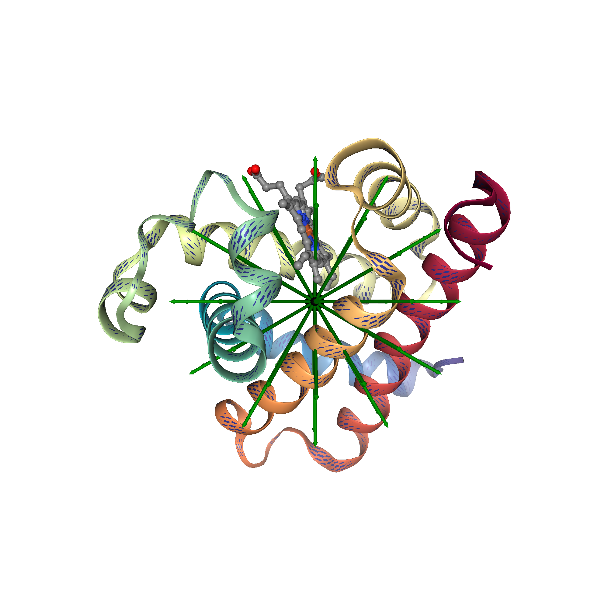

# Radius of Gyration of Proteins

This repository contains data and Jupyter notebooks to **compute and visualize the radius of gyration (Rg)** of protein structures.

The radius of gyration is a fundamental scalar quantity that characterizes the **spatial distribution of mass** in a protein and is widely used in:
- Structural biology
- Polymer physics
- Protein folding and compaction analysis

---

## 📐 What is Radius of Gyration?

For a protein with atomic coordinates \( \mathbf{r}_i \) and center of mass \( \mathbf{R}_{CM} \), the radius of gyration is defined as:

\[
R_g = \sqrt{\frac{1}{N} \sum_i \left| \mathbf{r}_i - \mathbf{R}_{CM} \right|^2}
\]

It provides a measure of how extended or compact a protein structure is.

---

## 🧬 Visualization Approach

- Protein structure is shown as a **cartoon representation**
- The **center of mass (COM)** is shown as a black sphere
- The radius of gyration is visualized using **radial arrows** extending from the COM
- Arrow length corresponds to the computed **Rg**

This avoids misleading hard boundaries while clearly conveying the scale of Rg.

---

## 🖼️ Example Visualizations

### Example 1: Alpha-Helix Protein Radius of Gyration

---

### Example 2: Beta-Sheet Protein Radius of Gyration

---
